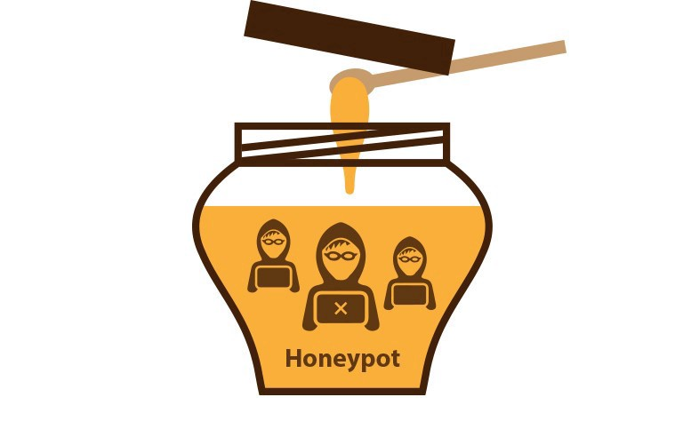
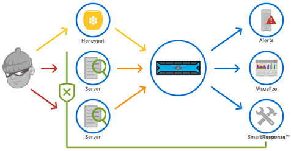
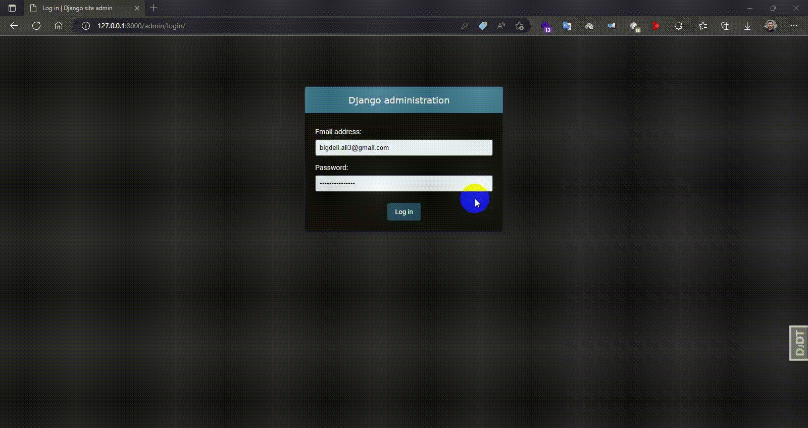

<div align="center">

<h1 align="center">Django HoneyPot Sample</h1>
<h3 align="center">Sample Project to show you how to implement HoneyPot to django admin</h3>
</div>
<p align="center">
<a href="https://www.python.org" target="_blank">  </a>
<a href="https://www.djangoproject.com/" target="_blank">  </a> 
<a href="https://www.docker.com/" target="_blank">  </a>
<a href="https://www.postgresql.org" target="_blank">  </a>
<a href="https://git-scm.com/" target="_blank">  </a>
</p>

# Guideline
- [Guideline](#guideline)
- [Goal](#goal)
- [What is HoneyPot](#what-is-honeypot)
- [How honeypots work](#how-honeypots-work)
- [Development usage](#development-usage)
  - [Clone the repo](#clone-the-repo)
  - [Enviroment Varibales](#enviroment-varibales)
  - [Build everything](#build-everything)
- [Testing](#testing)
- [Got Stuck](#got-stuck)
- [Note](#note)
  - [Check it out in a browser](#check-it-out-in-a-browser)
- [License](#license)
- [Bugs](#bugs)

# Goal
This project main goal is to provide a sample to show you how to implement HoneyPot theory in django.

# What is HoneyPot

<div align="center">

</div>
One honeypot definition comes from the world of espionage, where Mata Hari-style spies who use a romantic relationship as a way to steal secrets are described as setting a ‘honey trap’ or ‘honeypot’. Often, an enemy spy is compromised by a honey trap and then forced to hand over everything he/she knows.

In computer security terms, a cyber honeypot works in a similar way, baiting a trap for hackers. It's a sacrificial computer system that’s intended to attract cyberattacks, like a decoy. It mimics a target for hackers, and uses their intrusion attempts to gain information about cybercriminals and the way they are operating or to distract them from other targets.


# How honeypots work
<div align="center">

</div>
The honeypot looks like a real computer system, with applications and data, fooling cybercriminals into thinking it's a legitimate target. For example, in our case it would be the admin page. Once the hackers are in, they can be tracked, and their behavior assessed for clues on how to make the real network more secure.


# Development usage
You'll need to have [Docker installed](https://docs.docker.com/get-docker/).
It's available on Windows, macOS and most distros of Linux. 

If you're using Windows, it will be expected that you're following along inside
of [WSL or WSL
2](https://nickjanetakis.com/blog/a-linux-dev-environment-on-windows-with-wsl-2-docker-desktop-and-more).

That's because we're going to be running shell commands. You can always modify
these commands for PowerShell if you want.


## Clone the repo
Clone this repo anywhere you want and move into the directory:
```bash
git clone https://github.com/AliBigdeli/Django-Multiple-File-Upload-Sample.git
```

## Enviroment Varibales
enviroment varibales are included in docker-compose.yml file for debugging mode and you are free to change commands inside:

```yaml
services:
  backend:
  command: sh -c "python manage.py check_database && \ 
                      yes | python manage.py makemigrations  && \
                      yes | python manage.py migrate  && \                    
                      python manage.py runserver 0.0.0.0:8000"
    environment:      
      - DEBUG=True
```


## Build everything

The first time you run this it's going to take 5-10 minutes depending on your
internet connection speed and computer's hardware specs. That's because it's
going to download a few Docker images such as minio and build the Python + requirements dependencies. and dont forget to create a .env file inside dev folder for django and postgres with the samples.

```bash
docker compose up --build
```

Now that everything is built and running we can treat it like any other Django
app.

# Testing 
in order to test the mechanism just head to the admin page (the fake one) which is available through the url bellow:

- <http://127.0.0.1:8000/admin/login>

as you can see in the url file of project we have two admin pages:
```python

urlpatterns = [
    path("admin/", include("honeypot.urls")),
    path("secret-admin-entrance/", admin.site.urls),
    ...
]
```
the one which leads to honeypot is fake and the other one is ok.

this page is identical to the admin page but the difference is, no matter how many times you try, you cant login from here. attackers will try to hit the url of admin and using username and passwords to brute force to the admin  page but, they cant cause it will lead to nothing and after a few times trying to test password it will lead to being blocked.
<div align="center">

</div>


and user with the previous ip address cannot use the whole website.

**Note:** this is just a sample and you can change it according to your needs.

you can always change the amount of tryout in the settings by changing the value of the ```HONEYPOT_LOGIN_TRYOUT```

```python
HONEYPOT_LOGIN_TRYOUT = 5
```

# Got Stuck
im pretty sure in your first test you will be locked out and you want to go back, so in order to do that just follow the instructions bellow and remove your ip address from blacklists.

```shell
docker-compose exec backend sh -c "python manage.py shell" 

Python 3.10.10 (main, Mar  1 2023, 15:41:47) [GCC 8.3.0] on linux
Type "help", "copyright", "credits" or "license" for more information.
(InteractiveConsole)

>>> from honeypot.models import BlackList

>>> BlackList.objects.all().delete()
(1, {'honeypot.BlackList': 1})

```
# Note

If you receive an error about a port being in use? Chances are it's because
something on your machine is already running on port 8000. then you have to change the docker-compose.yml file according to your needs.


## Check it out in a browser

Visit <http://localhost:8000> in your favorite browser.


# License
MIT.


# Bugs
Feel free to let me know if something needs to be fixed. or even any features seems to be needed in this repo.
